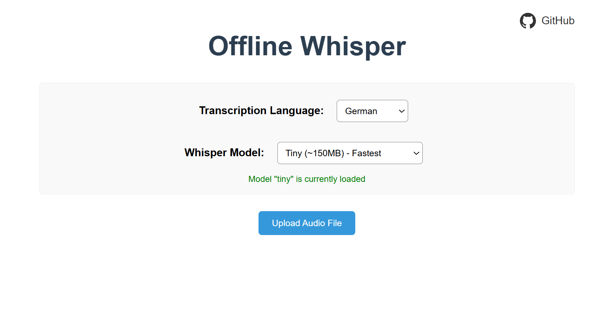

# Offline Whisper

A lightweight Docker-based implementation of OpenAI's Whisper model for local speech recognition. This project provides a simple web interface for uploading audio files and recording audio directly through the browser for transcription.

## Features

- Local deployment of OpenAI's Whisper model
- Web interface for audio file uploads
- Browser-based audio recording (localhost only)
- Language selection directly in the web interface
- Configurable Whisper model size (requires Docker-Build)
- Docker containerization for easy deployment
- No data persistence - all audio files and transcriptions are deleted after processing

## Usage

### For End Users

If you simply want to use the application without modifying the code, you can run the pre-built Docker image.

1. **Pull the Docker image**

   ```bash
   docker pull ghcr.io/mgiesen/offline-whisper:latest
   ```

2. **Run the container**

   ```bash
   docker run -d -p 8077:8077 ghcr.io/mgiesen/offline-whisper:latest
   ```

3. **Access the web interface** at `http://localhost:8077`



### For Developers

If you want to modify the code before running the application, follow these steps:

1. **Clone the repository**

   ```bash
   git clone https://github.com/mgiesen/offline-whisper.git
   cd offline-whisper
   ```

2. **Configure default model size (optional)**
   You can change the default model size by modifying the environment variables in `docker-compose.yml`:

   ```yaml
   whisper:
     environment:
       - WHISPER_MODEL=large
   ```

   **Available model sizes:**

   - `tiny`: Fastest, lowest accuracy
   - `base`: Fast with decent accuracy
   - `small`: Good balance of speed and accuracy
   - `medium`: Better accuracy, slower
   - `large`: Best accuracy, slowest

3. **Build and start the containers**

   ```bash
   docker-compose up -d
   ```

4. **Access the web interface** at `http://localhost:8077`

## Important Notes

- The microphone recording feature only works on localhost or with HTTPS due to browser security restrictions
- The Whisper model will be downloaded during the first build (size depends on the selected model)
- All uploaded audio files and generated transcripts are automatically deleted after processing for privacy
- No data is stored persistently - everything is processed in memory only
- Model size comparison:
  - `tiny`: ~150MB
  - `base`: ~150MB
  - `small`: ~500MB
  - `medium`: ~1.5GB
  - `large`: ~6GB

## Technical Details

### Limitations

- Limited error handling for concurrent requests
- No HTTPS configuration included
- Changing model size requires restarting the container

## Acknowledgments

This project uses:

- [OpenAI Whisper](https://github.com/openai/whisper)
- [FastAPI](https://fastapi.tiangolo.com/)
- [Nginx](https://nginx.org/)
